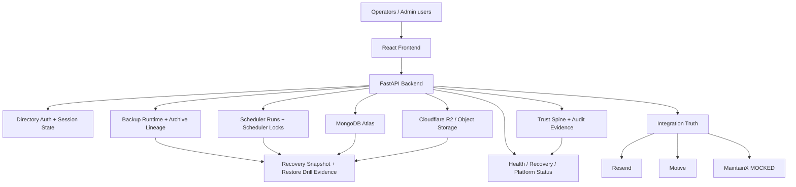

# OPERATIONAL DEPENDENCY GRAPH

Date: 2026-07-27  
Program: MASCI OPS — Platform Survivability Program  
Scope: Preview-only dependency classification for survivability validation

---

## 1. Dependency graph summary

---

## 2. Dependency register

| Dependency | Criticality | Upstream systems | Downstream systems | Single point of failure | Existing redundancy | Recovery mechanism | Monitoring coverage | Ownership |
|---|---|---|---|---|---|---|---|---|
| FastAPI backend process | **Critical** | Supervisor-managed pod/runtime | All `/api/*` surfaces, schedulers, recovery, auth, trust | Yes — single preview backend process | Hot reload + supervisor restart management | Supervisor restarts, health/readiness probes, recovery dashboard visibility | `/api/health`, `/api/healthz`, `/api/ready`, `/api/health/full`, `/api/admin/platform/status` | Backend Platform |
| MongoDB Atlas (`masci_safety_preview`) | **Critical** | Network + Mongo credentials + runtime identity | Auth, sessions, backup ledgers, scheduler state, trust events, drill evidence | Yes | Durable Atlas persistence; no alternate DB evidenced in Preview | Readiness/health detection, fail-closed config recovery, namespace restore tooling | `/api/health/full`, integration truth (`mongo`), recovery snapshot, runtime identity | Data Platform |
| Cloudflare R2 / S3-compatible object store | **Critical** | Storage credentials + bucket/prefix authority | Archive lineage, backup verification, restore drill downloads, file/object references | Yes | Manifest + checksum sidecars, lineage reconciliation | Canonical archive-lineage selection, checksum/manifest validation, bounded restore tooling | Recovery snapshot, backup verification preview/state, lineage evidence | Storage Platform |
| Directory auth + session binding (`user_directory`, `directory_sessions`, `session_activity`) | **Critical** | MongoDB + admin HMAC secret + session middleware | Admin-gated survivability endpoints and operational access continuity | Yes | Per-user admin token + bound directory session; no separate emergency provider evidenced | Multi-login reissue, fail-closed session validation, token re-minting | Live admin route probes, auth continuity tests, session activity collection | Identity/Auth |
| Backup runtime (`backup_jobs`) | **High** | Backend process + MongoDB + backup schedule | Recovery posture, restore guardrails, archive lineage, drill protection | Yes | Durable job ledger + stale reclamation | Lease ownership, heartbeat, stale recovery, overlap classification | Recovery snapshot, backup runtime state collectors | Survivability/Ops |
| Scheduler execution ledger (`scheduler_runs`, `scheduler_locks`) | **High** | Backend scheduler loops + MongoDB | Digest schedulers, backup verification scheduler, operator observability | Partial | Unique slot-key dedup + durable audit rows | Duplicate slot rejection, stale lock detection, completion/failure marking | `/api/admin/scheduler-runs`, recovery snapshot scheduler signal | Backend Platform |
| Archive lineage resolver | **High** | Mongo backup evidence + R2 metadata + manifest/checksum evidence | Recovery posture, backup verification, restore selection | Partial | Timestamp precedence + quarantine logic | Corruption rejection, environment/bucket/prefix fail-closed checks | `/api/admin/recovery/snapshot`, `/api/admin/backup-verification/*` | Survivability/Ops |
| Restore tooling and drill evidence (`drill_runs`) | **High** | R2 archive access + Mongo + bounded scripts | Recovery posture, trust score, survivability proof | Partial | Namespace-scoped drill path; full side-DB path blocked externally | Namespace restore drill, drill evidence persistence, bounded cleanup | Recovery snapshot, drill ledger, restore certification evidence | Survivability/Ops |
| Trust Spine and audit evidence | **High** | Backend lifecycle emitters + MongoDB | Trust dashboard, audit integrity claims, survivability failure visibility | Partial | Append-only event stream across workflows | Failed-stage visibility, cleanup of synthetic probe evidence, audit collections | `/api/admin/trust-spine`, platform status, audit collections | Trust/Governance |
| Monitoring and recovery posture surfaces | **High** | Backend process + MongoDB + archive lineage + trust surfaces | Operators, certification decisions, regression gate | No single data source, but backend availability is required | Fan-in from canonical owners | Truth projection over canonical subsystems; does not self-certify | `/api/health*`, `/api/admin/recovery/snapshot`, `/api/admin/platform/status` | Platform Ops |
| Resend provider | **Medium** | Runtime config + provider service | Notification delivery and backup verification email sends | Yes | Preview safe-capture boundary; provider not required for core API continuity in Preview | Safe-capture fallback and truthful disablement | Integration truth, notification evidence, webhook collections | Notifications |
| Motive provider | **Medium** | Runtime config + provider service | External telematics continuity only | Yes | No local redundancy evidenced | Canonical truth reports live/idle/unreachable state honestly | Integration truth | Transport Platform |
| MaintainX provider | **Low** | Mocked preview state | Work-order integration only | No (Preview MOCKED) | MOCKED by design in Preview | Mock boundary, not live recovery | Integration truth (`maintainx=MOCKED`) | Operations Integrations |

---

## 3. Dependency-level conclusions

1. **MongoDB Atlas**, **FastAPI backend runtime**, and **Cloudflare R2** are the three critical operational anchors.
2. **Directory session binding** is also critical for admin survivability access because admin routes fail closed without the matching directory session.
3. **Backup runtime**, **scheduler runs**, **archive lineage**, and **restore drill evidence** provide the main recovery continuity chain.
4. **Trust Spine** preserves trust/audit integrity by surfacing degraded or failed lifecycle evidence rather than masking it.
5. **External providers** are survivability dependencies only where they affect bounded operational continuity; their honest disabled/mocked/unreachable reporting is already implemented.
