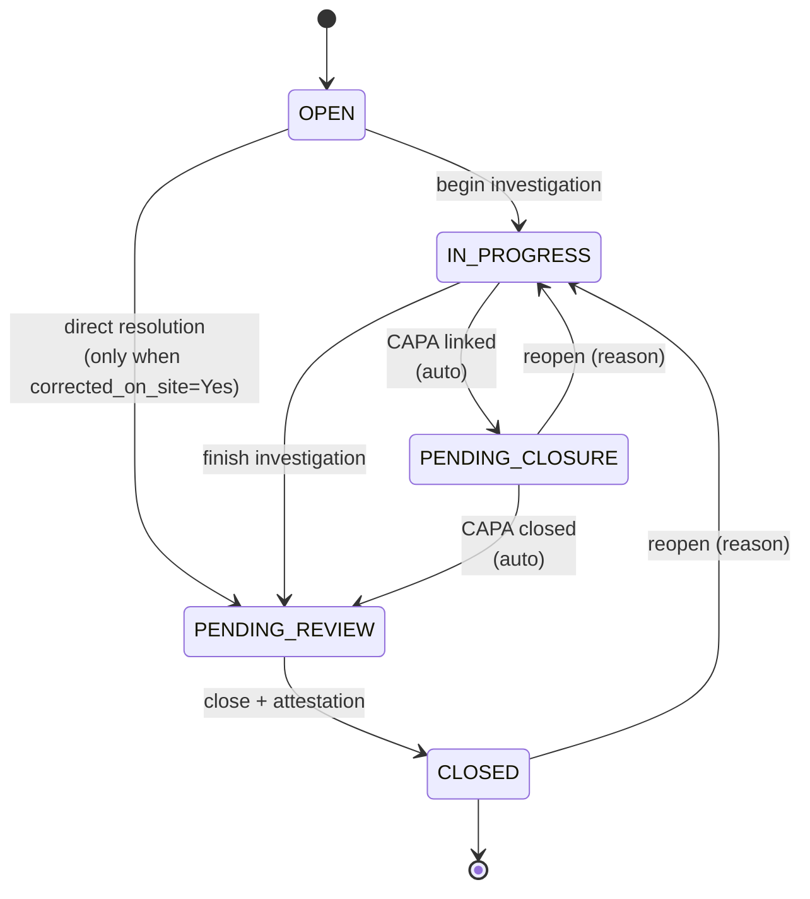

# Phase 1A · State Machine Specification

**Program:** OMEGA · Platform Completion Program · Phase 1A · DESIGN
**Companion:** `PHASE1A_WORKFLOW_DESIGN.md`
**Mode:** Design-only · no code
**Date:** 2026-06-01

---

## 0 · Canonical 5-state machine (common to all Phase 1A workflows)

```
                                       ┌──────────────────┐
                                       │      OPEN        │  ◄────────┐
                                       └────────┬─────────┘            │
                                                │ (begin work)         │
                                                ▼                      │
                                       ┌──────────────────┐            │
                                       │   IN_PROGRESS    │  ◄─────┐   │
                                       └────────┬─────────┘        │   │
                                                │ (finish work)    │   │
                                                ▼                  │   │
                                       ┌──────────────────┐        │   │
                                       │ PENDING_REVIEW   │  ◄──┐  │   │ (return-to-field)
                                       └────────┬─────────┘     │  │   │  (DR-specific)
                                       (optional│ external)     │  │   │
                                                ▼               │  │   │
                                       ┌──────────────────┐     │  │   │
                                       │ PENDING_CLOSURE  │     │  │   │
                                       └────────┬─────────┘     │  │   │
                                          (dep resolved · auto) │  │   │
                                                │               │  │   │
                                                ▼               │  │   │
                                       ┌──────────────────┐     │  │   │
                                       │     CLOSED       │─────┴──┴───┘
                                       └──────────────────┘
                                                │
                                                │  REOPEN (with reason)
                                                ▼
                                            (back to IN_PROGRESS)
```

* **Forward transitions** (left-to-right) require role gate + valid current state.
* **REOPEN** is always to `IN_PROGRESS` with a required `reason` — never directly to OPEN, PENDING_REVIEW, or PENDING_CLOSURE.
* **Return-to-field** (DR only) is an exception path from CLOSED → OPEN with required `return_reason` and notification.

---

## 1 · Incident state machine

### 1.1 · States & guards

| From | To | Authorized roles | Guards / pre-conditions | Side effects |
|---|---|---|---|---|
| `OPEN` | `IN_PROGRESS` | Safety · Admin · Super-Admin | none | `state_changed_at`, `state_changed_by` set |
| `OPEN` | `PENDING_REVIEW` | Safety · Admin · Super-Admin | `corrected_on_site == "Yes"` AND no CAPA linkage; OR investigation complete instantly | sets metadata flag `direct_resolution=true` |
| `IN_PROGRESS` | `PENDING_REVIEW` | Safety · Admin · Super-Admin | no required guards | — |
| `IN_PROGRESS` | `PENDING_CLOSURE` | (auto) | ≥1 linked CAPA in non-Closed state | `auto_transition=true` |
| `PENDING_REVIEW` | `CLOSED` | Safety · Admin · Super-Admin | no linked CAPA in Open/InProgress/PendingReview state; OSHA attestation if applicable; closer attestation comment | sets `closed_at`, `closed_by`, `osha_closure_attested` |
| `PENDING_CLOSURE` | `PENDING_REVIEW` | (auto) | last linked CAPA reaches Closed/Verified | `auto_transition=true` |
| `PENDING_CLOSURE` | `IN_PROGRESS` | Safety · Admin · Super-Admin | `reason` required | resets PENDING_CLOSURE entry |
| `CLOSED` | `IN_PROGRESS` | Safety · Admin · Super-Admin | `reason` required | `reopened_count++` |

### 1.2 · Forbidden transitions

* `PENDING_REVIEW → IN_PROGRESS` (use REOPEN from CLOSED instead — or never went to REVIEW in error; in that case, Admin can DELETE the offending state event via admin tool)
* `CLOSED → CLOSED` (idempotency · 409)
* `OPEN → CLOSED` directly (must go through PENDING_REVIEW for attestation)
* Any transition by HR / PM / FL / Dispatch / Shop / Employee (not authorized)

### 1.3 · Required metadata per transition

| Transition | Required `reason` | Required `metadata` |
|---|---|---|
| OPEN → IN_PROGRESS | optional | none |
| OPEN → PENDING_REVIEW | optional | `{direct_resolution: true}` |
| IN_PROGRESS → PENDING_REVIEW | optional | none |
| PENDING_REVIEW → CLOSED | optional | `{closer_attestation: "..."}` |
| PENDING_REVIEW → CLOSED (OSHA-recordable) | optional | `{osha_attested: true, osha_form_link: "..."}` (required field) |
| any → IN_PROGRESS (REOPEN) | **required** | none |
| auto-transitions | n/a | `{auto: true, triggering_event: "capa_closed:<capa_id>"}` |

---

## 2 · Daily Report state machine

### 2.1 · States & guards

| From | To | Authorized roles | Guards | Side effects |
|---|---|---|---|---|
| `OPEN` | `IN_PROGRESS` | PM (assigned to job) · Admin · Super-Admin | none | — |
| `IN_PROGRESS` | `CLOSED` | same | PM hours attestation; if `accident_or_incident_today == "Yes"`: linked incident exists | sets `approved_at`, `approved_by` |
| `IN_PROGRESS` | `OPEN` (return-to-field) | same | `return_reason` required | notifies submitter via `notifications` collection |
| `OPEN` | `OPEN` (re-submission via PATCH) | submitter (field) | only the original submitter, only while state=OPEN with `return_reason` set | re-clears `return_reason`; appends to revision history |
| `CLOSED` | `IN_PROGRESS` (REOPEN) | PM (assigned) · Admin · Super-Admin | `reason` required | `reopened_count++` |

### 2.2 · Forbidden transitions

* `OPEN → CLOSED` directly (must go through IN_PROGRESS for review attestation)
* `CLOSED → OPEN` directly (use REOPEN to IN_PROGRESS instead)
* Transitions by Safety / HR / Dispatch / Shop / FL / Employee (not authorized)

### 2.3 · Required metadata

| Transition | Required |
|---|---|
| IN_PROGRESS → CLOSED | `closer_attestation` checkbox in metadata |
| IN_PROGRESS → OPEN return-to-field | `return_reason` required |
| any → IN_PROGRESS REOPEN | `reason` required |

---

## 3 · Payroll Variance Batch state machine

### 3.1 · States & guards

| From | To | Authorized roles | Guards | Side effects |
|---|---|---|---|---|
| `OPEN` | `IN_PROGRESS` | (auto) | first row's `decision` is set | `auto_transition=true` |
| `IN_PROGRESS` | `PENDING_REVIEW` | (auto) | all rows have a `decision` | `auto_transition=true` |
| `PENDING_REVIEW` | `IN_PROGRESS` | HR · Admin · Super-Admin | one or more rows had their decision reset | — |
| `PENDING_REVIEW` | `CLOSED` | HR · Admin · Super-Admin | Sandy attestation + no row left null | sets `finalized_at`, `finalized_by`, `finalization_attestation` |
| `CLOSED` | `IN_PROGRESS` (REOPEN) | HR · Admin · Super-Admin | `reason` required | `reopened_count++`; can re-edit any row decision |

### 3.2 · Auto-transition triggers

* On row decision write/update/delete: re-evaluate batch state
* All-rows-decided check is atomic (single Mongo query)

### 3.3 · Forbidden transitions

* `OPEN → PENDING_REVIEW` (must go through IN_PROGRESS auto)
* `OPEN → CLOSED` direct (cannot bypass)
* `IN_PROGRESS → CLOSED` direct (must reach PENDING_REVIEW first)

---

## 4 · QA/QC Inspection · Inspection-level state machine

| From | To | Authorized roles | Guards | Side effects |
|---|---|---|---|---|
| `OPEN` | `IN_PROGRESS` | PM (job-scoped) · Admin | none | — |
| `IN_PROGRESS` | `PENDING_REVIEW` | (auto) | every deficiency in non-OPEN state | `auto_transition=true` |
| `PENDING_REVIEW` | `CLOSED` | PM · Admin · Super-Admin | every deficiency CLOSED | sets `closed_at`, `closed_by` |
| `PENDING_REVIEW` | `IN_PROGRESS` | (auto) | a deficiency reverts to OPEN/IN_PROGRESS | — |
| `CLOSED` | `IN_PROGRESS` (REOPEN) | PM · Admin · Super-Admin | `reason` required | reopens; may reopen child deficiencies |

## 5 · QA/QC Inspection · Deficiency-level state machine

| From | To | Authorized roles | Guards | Side effects |
|---|---|---|---|---|
| `OPEN` | `IN_PROGRESS` | PM · Admin (sets assignment) | `assigned_to` must be set | — |
| `IN_PROGRESS` | `PENDING_REVIEW` | PM · Field Leadership · Admin | crew claims resolved; optional `resolution_notes` | — |
| `PENDING_REVIEW` | `CLOSED` | PM · Admin · Super-Admin | PM verifies fix | sets `resolved_at`, `resolved_by` |
| `PENDING_REVIEW` | `IN_PROGRESS` | PM · Admin | rejected verification | `reason` required |
| `CLOSED` | `IN_PROGRESS` (REOPEN) | PM · Admin · Super-Admin | `reason` required | — |

Inspection-level auto-transitions react to deficiency state changes (eventual consistency · same-request transaction).

---

## 6 · Site Inspection state machines

**Inspection-level**: identical to QA/QC inspection-level (§4) with Safety officer roles instead of PM.

**Finding-level**: identical to QA/QC deficiency-level (§5) with Safety officer / FL roles.

---

## 7 · State machine implementation strategy (informational · for Build stage)

### 7.1 · Pure backend validation

```python
ALLOWED_TRANSITIONS = {
    "incident": {
        "OPEN":           {"IN_PROGRESS", "PENDING_REVIEW"},
        "IN_PROGRESS":    {"PENDING_REVIEW", "PENDING_CLOSURE"},
        "PENDING_REVIEW": {"CLOSED"},
        "PENDING_CLOSURE":{"PENDING_REVIEW", "IN_PROGRESS"},
        "CLOSED":         {"IN_PROGRESS"},  # reopen only
    },
    "daily_report": {
        "OPEN":           {"IN_PROGRESS"},
        "IN_PROGRESS":    {"CLOSED", "OPEN"},  # OPEN = return-to-field
        "CLOSED":         {"IN_PROGRESS"},
    },
    "payroll_variance_batch": {
        "OPEN":           {"IN_PROGRESS"},
        "IN_PROGRESS":    {"PENDING_REVIEW"},
        "PENDING_REVIEW": {"CLOSED", "IN_PROGRESS"},
        "CLOSED":         {"IN_PROGRESS"},
    },
    "qaqc_inspection": {
        "OPEN":           {"IN_PROGRESS"},
        "IN_PROGRESS":    {"PENDING_REVIEW"},
        "PENDING_REVIEW": {"CLOSED", "IN_PROGRESS"},
        "CLOSED":         {"IN_PROGRESS"},
    },
    "qaqc_deficiency": {
        "OPEN":           {"IN_PROGRESS"},
        "IN_PROGRESS":    {"PENDING_REVIEW"},
        "PENDING_REVIEW": {"CLOSED", "IN_PROGRESS"},
        "CLOSED":         {"IN_PROGRESS"},
    },
    "site_inspection": "qaqc_inspection-equivalent",
    "site_finding":    "qaqc_deficiency-equivalent",
}
```

### 7.2 · Role gates

Defined in `PHASE1A_ROLE_MATRIX.md`.

### 7.3 · Validation algorithm (per transition request)

```
1. fetch doc with current lifecycle_state (or compute from read-shim)
2. assert from_state == current
3. assert to_state in ALLOWED_TRANSITIONS[workflow][from_state]
4. assert actor_role in role_matrix[workflow][from_state][to_state]
5. validate required metadata fields (reason, attestation, etc.)
6. write workflow_state_events row + update doc.lifecycle_state
7. for auto-cascading transitions: emit follow-on transition
8. return updated doc
```

### 7.4 · Idempotency

* Compound unique index on `workflow_state_events`: `{workflow_type, doc_id, to_state, actor_user_id, occurred_at_minute}` (compound)
* DuplicateKeyError → 409 to client

---

## 8 · Visual reference (Mermaid · for design docs)



---

## 9 · Coverage check (every from-state has a forward edge)

| Workflow | OPEN forward? | IN_PROG forward? | PEND_REV forward? | PEND_CLO forward? | CLOSED reopen? |
|---|---|---|---|---|---|
| Incident | ✅ (2) | ✅ (2) | ✅ (1) | ✅ (2) | ✅ |
| Daily Report | ✅ (1) | ✅ (2) | n/a (skipped) | n/a | ✅ |
| Payroll Variance | ✅ (1, auto) | ✅ (1, auto) | ✅ (2) | n/a | ✅ |
| QA/QC Inspection | ✅ (1) | ✅ (1, auto) | ✅ (2) | n/a | ✅ |
| QA/QC Deficiency | ✅ (1) | ✅ (1) | ✅ (2) | n/a | ✅ |
| Site Inspection | (same as QA/QC) | | | | |
| Site Finding | (same as QA/QC deficiency) | | | | |

No state is a dead-end (every state has at least one outbound transition).

---

## 10 · OMEGA discipline

🟢 Design-only · state machine spec · transition guards · forbidden transitions enumerated · no code. Continue to `PHASE1A_ROLE_MATRIX.md`.
